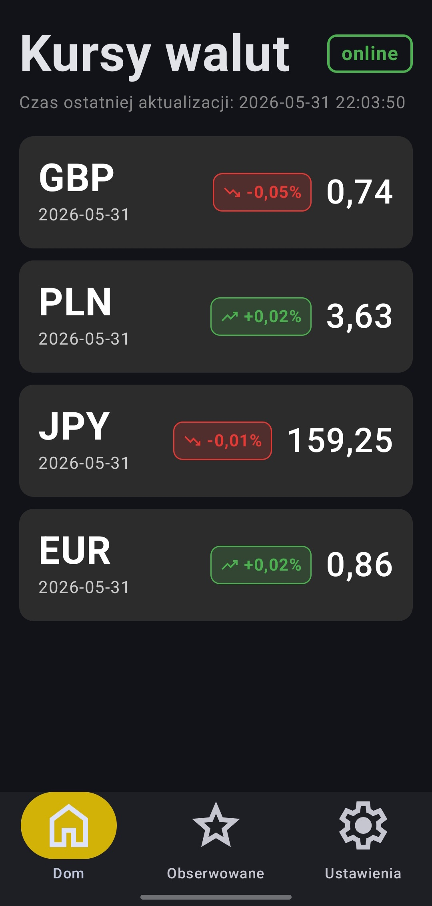
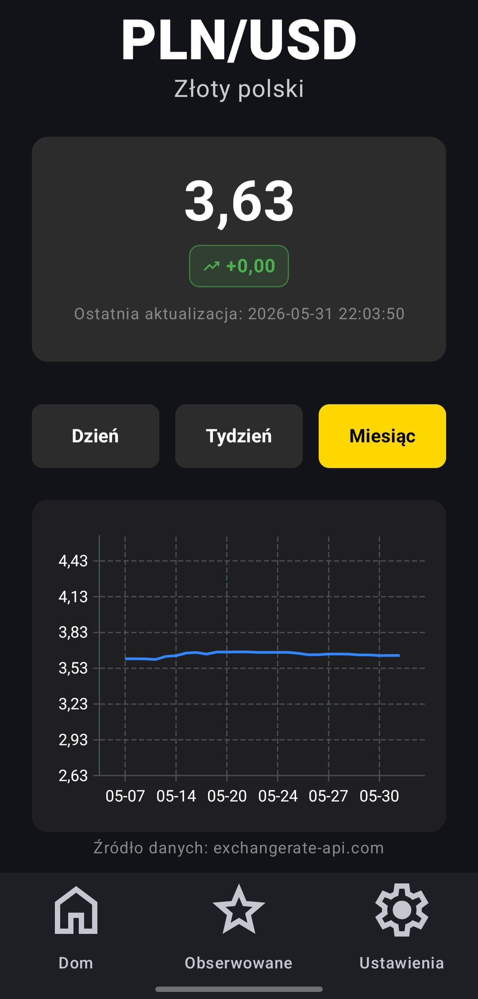
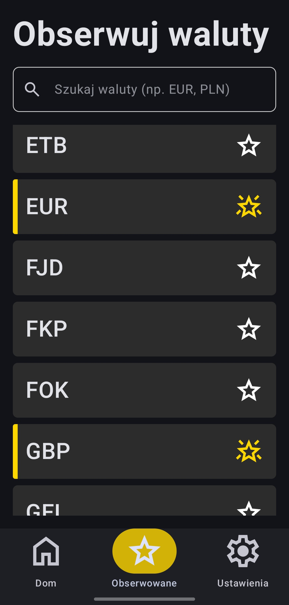
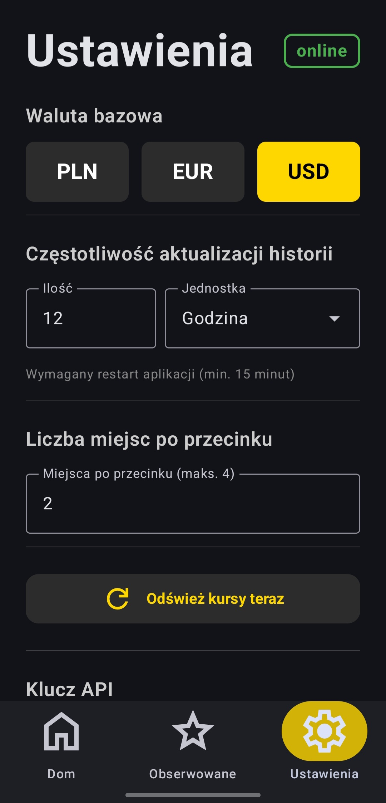
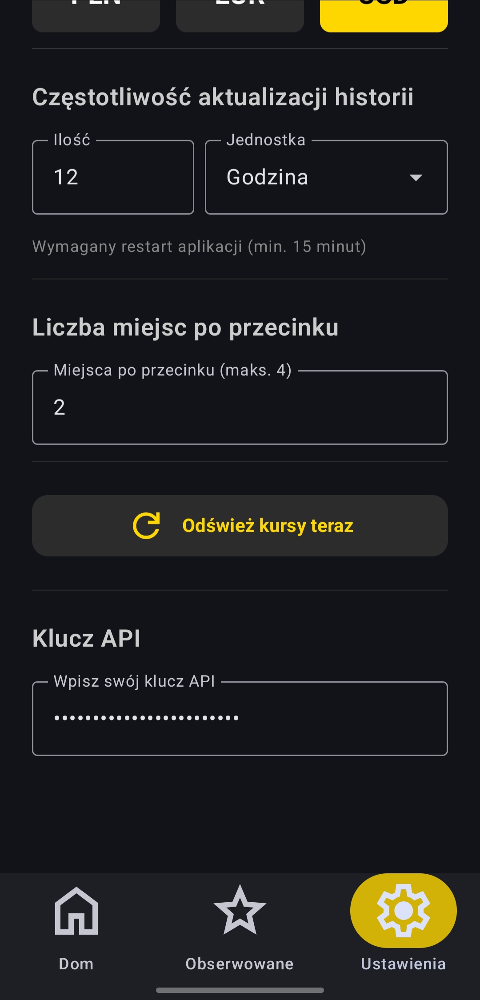

# Currency Rate Tracking App

An Android application for tracking real-time currency exchange rates and analyzing historical trends. The project is built using **Jetpack Compose** and modern Kotlin development standards.

---

## Screenshots

  
  
  

  
  

---

## Key Features

- **Home Screen**: Overview of tracked currencies with dynamic trend indicators (gains/losses), date information, and last synchronization timestamp.
- **Search & Favorites**: Currency search and management of a personalized watchlist.
- **Charts**: Line charts for analyzing exchange rate changes over day, week, and month intervals.
- **Background Automation**: **WorkManager** handles daily automatic fetching of historical data.
- **Full Configuration**: Ability to change base currency, display format, and refresh frequency.
- **Security**: API key stored securely using **EncryptedSharedPreferences**.

---

## Technologies Used

- **Language**: Kotlin
- **UI**: Jetpack Compose (Material 3)
- **Networking**: Retrofit 2 + GSON
- **Charts**: Vico Charts
- **Background Work**: WorkManager
- **Storage**: SharedPreferences, EncryptedSharedPreferences & Internal File Storage
- **Security**: AndroidX Security Crypto

---

## Setup

1. Get a free API key from [exchangerate-api.com](https://www.exchangerate-api.com/).
2. Launch the app and go to **Settings**.
3. Paste your API key into the **API Key** field.
4. Refresh the data using the refresh button.

---

## Data Structure

The app uses local text files for offline functionality:

- `latest_rates.txt`: Latest fetched exchange rate data.
- `historical_rates.txt`: Historical data used for charts.
- `followed.txt`: List of user-followed currencies.